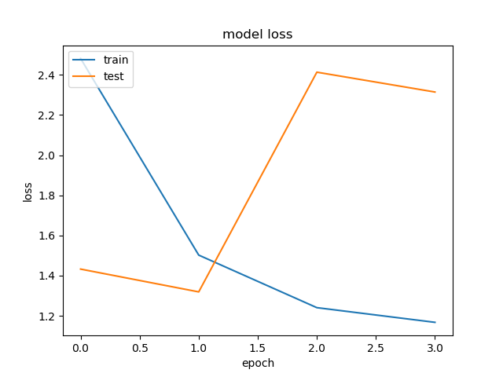

Sign Language Detection

Data

The data used for this model was provided by Kaggle.  Each letter of the alphabet is represented by 3000 training images of similar size, orientation, and resolution (200 X 200).  Surprisingly, the test dataset consists of a single image per letter.

The single biggest limitation to a swift solution appears to be computing power.  Model training frequently taxed the processor to 300%.

https://www.kaggle.com/grassknoted/asl-alphabet.

Training

Image detection was the theme I wanted to pursue.  The predictive model used, Convolutional Neural Networks, was chosen because they tend to do well on image detection projects.  

Most models were trained at an image resolution of 64 X 64 or 96 X 96.  An image size greater than 96 takes a prohibitively long time (2+ hours per epoch) to train.  Visually, 96 X 96 is the lowest resolution still detectable to the human eye.

For the first 10 models I used 5 X 5 filters (it seemed to get better results).  For the final model I switched to 3 X 3 filters.

Letters A, J and X have the lowest predictive power

