### Sign Language Detection

The ability of a visual detection system to recognize and translate sign language would be a major breakthrough. This system would allow deaf people with limited ability to speak to more easily communicate with individuals with limited understanding of sign language.

The project goal is to develop a model capable of translating American Sign Language (ASL) into British Sign Language (BSL).  The languages spoken in both countries are the same.  The sign languages are not: ASL letters are signed with one hand and BSL is signed with two.

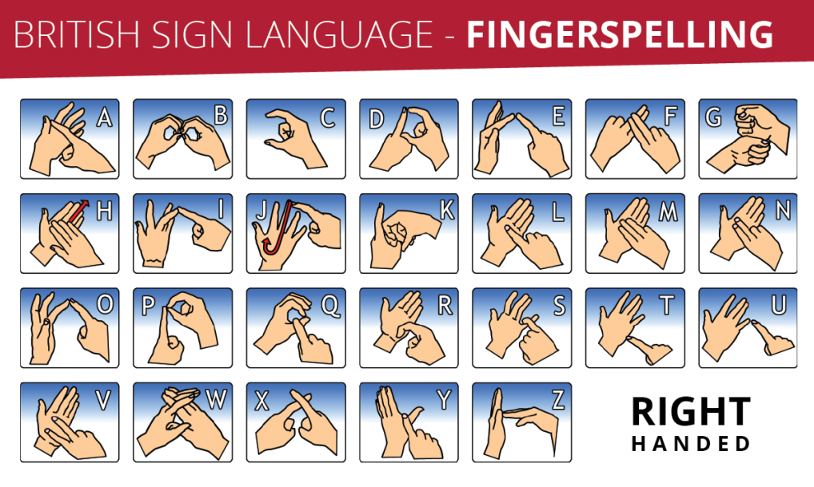
source: https://www.british-sign.co.uk/fingerspelling-alphabet-charts/
### Data

The data used for this model was provided by Kaggle:https://www.kaggle.com/grassknoted/asl-alphabet.  Each letter of the alphabet is represented by 3000 training images of similar size, orientation, and resolution (200 X 200).  Surprisingly, the test dataset consists of a single image per letter.

The single biggest limitation to a swift solution appears to be computing power.  Model training frequently taxed the processor to 300%.

### Two Approaches

I trained two separate models to see if I could improve results.  The first model consisted of 3000 unaltered images per letter of the alphabet.  The second tactic was to apply zeroes to all array elements outside of the skin color boundary.

### Training (CNN Model)

Image detection was the theme I wanted to pursue.  The predictive model used, Convolutional Neural Networks, was chosen because they tend to do well on image detection projects.  

Final Model Specs:

Activation:Tanh, Depth:32, Filter(3X3)
Activation:Tanh, Depth:32, Filter(3X3)
Activation:Relu, Depth:16, Filter(3X3)
Activation:Relu, Depth:16, Filter(3X3)
Activation:Relu, Depth:16, Filter(3X3)
Flatten Layer

Most models were trained at an image resolution of 64 X 64 or 96 X 96.  An image size greater than 96 takes a prohibitively long time (2+ hours per epoch) to train.  Visually, 96 X 96 is the lowest resolution still detectable to the human eye.

The final model utilized images at 128 by 128, 3 by 3 filters and a slide of 1.  The model consisted of one input layer, four hidden layers and an output layer.  Hyperbolic tangent was used for the first two layers, relu for the next 3 and softmax for categorical prediction.

After numerous training iterations CNN models appeared to crater at around 60 to 65% accuracy.  The two charts detailed below indicate a model stopping after four epochs because validation loss increased.

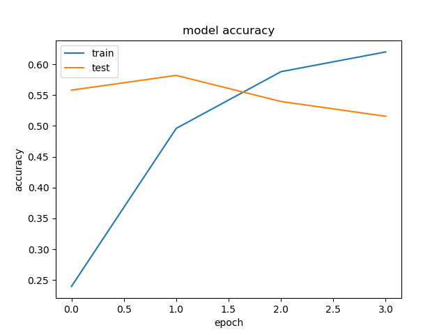

### The Experiment

Can I improve model results by eliminating all background colors.  This project involved significant effort.  I had to detect the correct threshold to bound on, create new directories, write a program capable of zeroing out all elements not contained in the array and retrain the model.

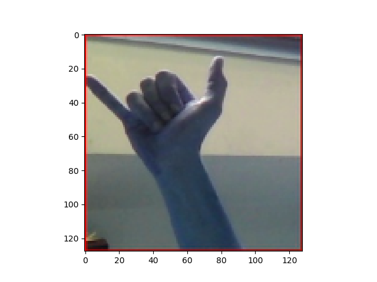

Below is a distribution of color intensities.  Perhaps if I can black out all non-skin color the model will improve.
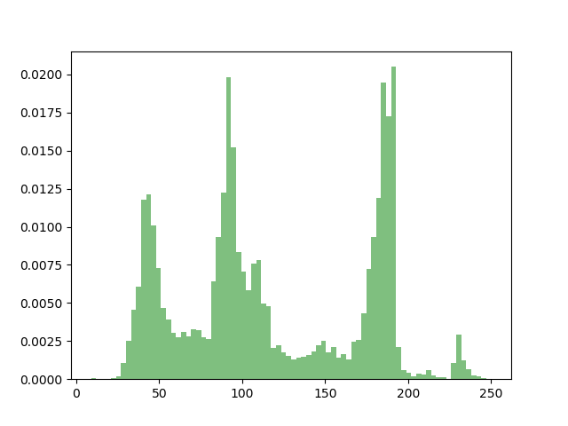

Distribution of color intensities between 25 and 60.
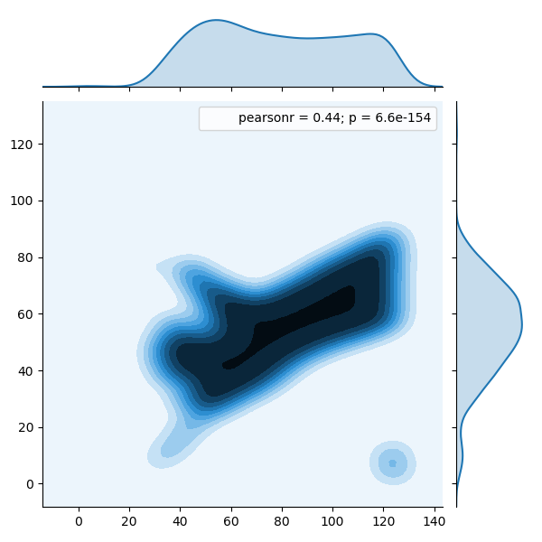

Distribution of color intensities between 80 and 105.
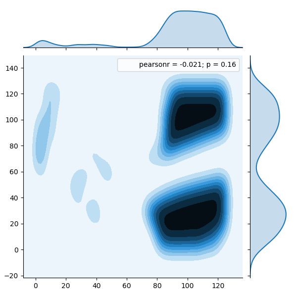

Distribution of color intensities between 170 and 195.
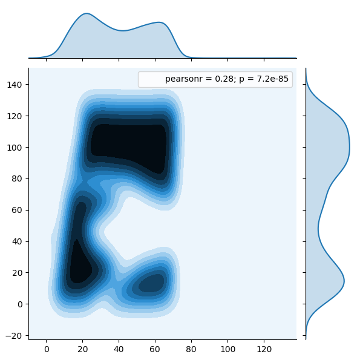

I created a second model where all pictures were altered.  Pixel intensity greater than 85 was set to zero in an effort to remove noise.  Altered images were run through the same model as non altered images.  Unfortunately, the model terminated early because of thermal issues.

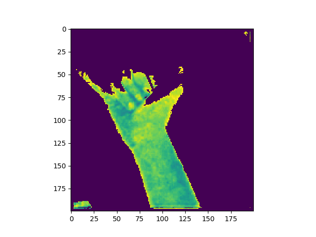

Altered Picture Originally Shaded

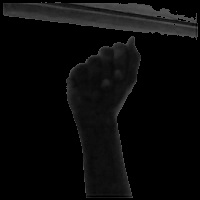

Altered Picture Not Originally Shaded

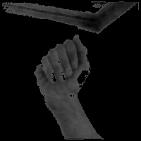

### Results

What was once a promising model erodes when predicting on the test set proved to be very disappointing when fed the fest set.  Two letters, P and C, were predicted 97 percent of the time.

### Letter Prediction Distribution

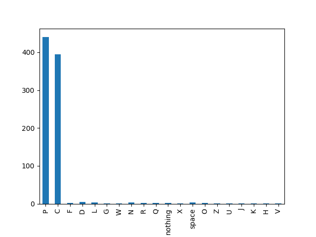

### P

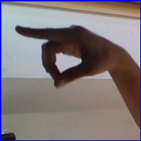

### C

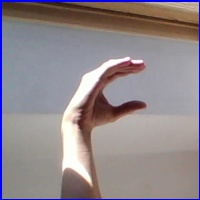

### Lessons Learned

* Predict on holdout set sooner.
* I must have made an error.
* The image alteration initiative did not appear to be trending in a promising manner.
* An eight core processor married to a GPU would have help immensely.

### Future Work

*  I will drastically improve this project in the next two weeks.
